# float、ポジショニング

## 目的

- floatの基本を理解する。
- ポジショニングを理解し、よりCSSでページコンテンツの見た目を整える。

## floatとは？

 `float` とは、簡単に説明すると、縦並びの要素を横並びにすることができるプロパティのことです。

CSSのプロパティである `float` は、要素が右か左に配置されるよう、コンテンツ内で特定します。
 `p` などのテキストやインライン要素があれば、 `float` で右か左に配置された要素の周りを囲むようにテキストやインライン要素が配置されます。

## floatプロパティの書き方

 `float` プロパティの書き方は非常に簡単です。

```css
float: 値;
```

これで基本的には横並びにさせたい要素を指定し、横並び表示にすることができます。

 `float` で指定できる値には以下の3つがあります。

| floatで指定できる値 | 指定の種類 |
| ------------- | -----:|
| right | 要素を右寄せに指定 |
| left | 要素を左寄せに指定 |
| none | 指定なし（ほぼ使わない） |


### floatプロパティの実践

実際にHTMLと組み合わせて `float` で要素のスタイルを指定してみましょう。
まず、HTMLとCSSで3つの要素を用意します。

```html
<div class="element1">
  要素１
</div>
<div class="element2">
  要素２
</div>
<div class="element3">
  要素３
</div>
```

```css
.element1 {
  background-color: yellow;
  width: 150px;
  height: 150px;
}
.element2 {
  background-color: blue;
  width: 150px;
  height: 150px;
}
.element3 {
  background-color: red;
  width: 550px;
  height: 150px;
}
```

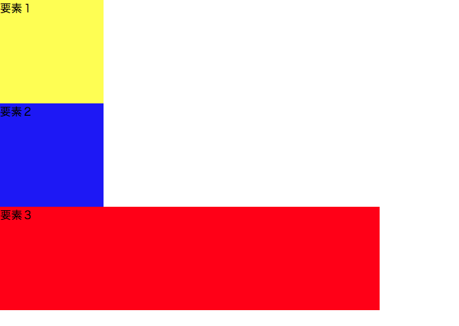

では、CSSで `float` プロパティを使って以下のようにそれぞれの要素にスタイルを指定していきます。

```css
.element1 {
  background-color: yellow;
  width: 150px;
  height: 150px;
  float: left;
}
.element2 {
  background-color: blue;
  width: 150px;
  height: 150px;
  float: left;
}
.element3 {
  background-color: red;
  width: 550px;
  height: 150px;
  float: left;
}
```

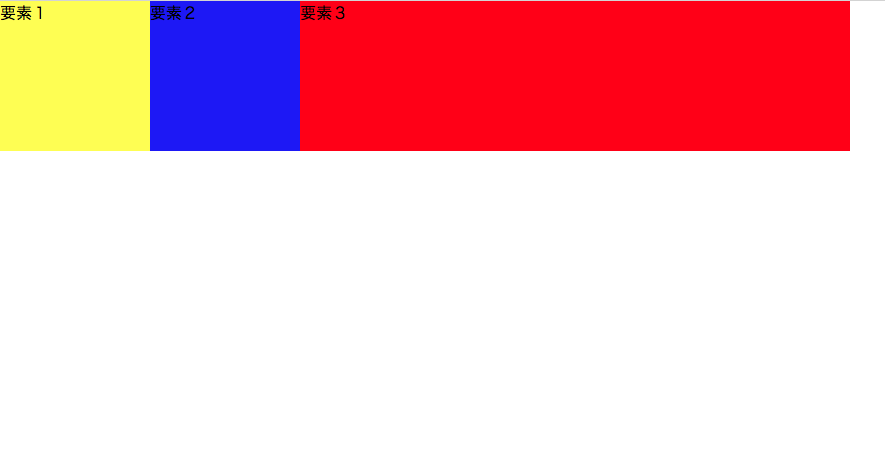

 `float: left;` と `float` プロパティで全ての要素を左寄せに配列させたので、要素3つともが横並びになりました。

## floatによる回り込みの問題

CSSでページをスタイルしていくにあたり、HTMLだけではできない `float` による要素の横並びはとても便利です。

ただし、 `float` には少しだけ注意すべきことがあります。
赤い要素３の `float` プロパティだけを試しに外してみるとどうなるか見てみましょう。

```css
.element1 {
  background-color: yellow;
  width: 150px;
  height: 150px;
  float: left;
}
.element2 {
  background-color: blue;
  width: 150px;
  height: 150px;
  float: left;
}
.element3 {
  background-color: red;
  width: 550px;
  height: 150px;
}
```

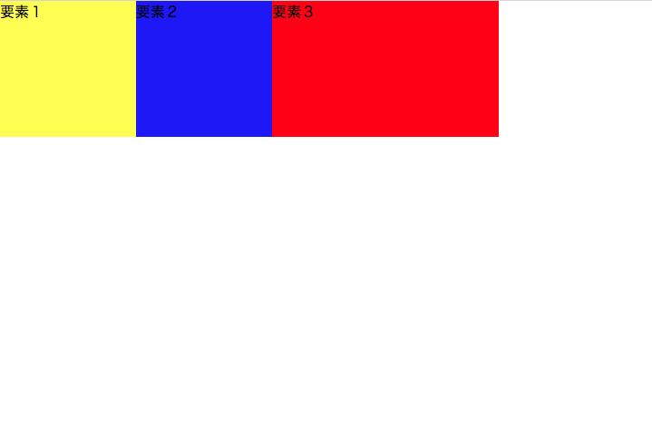

先ほどの全ての要素に `float` プロパティを左寄せで指定していた時と比べて、赤い要素の横幅が短くなっています。
そして、 `float` プロパティを赤い要素３だけ外しているのに、赤い要素はまだ横並びのままです。
一体どういうことなのでしょうか？

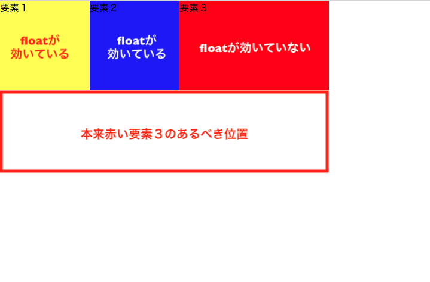

平面で見るとわからないのですが、 `float` プロパティのついた要素は、意味どおり、「浮く」状態になります。

先ほどの状態を平面ではなく、立体でとらえると理解できます。


つまり、 `float` プロパティのついた黄色い要素１と青い要素２が浮いていて、その背後に赤い要素３が回り込んでいるということなのです。

ブラウザでは、真正面から見ていることになるので、赤い要素３の横幅が縮小し、本来位置すべき黄色い要素１と青い要素２の下に位置しないという現象のように見えるということです。

## floatによる回り込みを解除する1：clearプロパティ

 `float` による要素が背後に回り込む現象を防ぐには、以下のように赤い要素３、つまり `float` プロパティのついていない要素に設定すると解除することができます。

```css
clear: both;
```

この設定を `clearプロパティ` と言います。
 `clearプロパティ` を指定することで、 `float` プロパティのついた黄色い要素１と青い要素２の背後に回り込まないので、赤い要素３は以下のように本来意図した位置に配置されるようになります。

 `clear` プロパティはほとんどの場合が `both` が値で問題ないです。


 ```css
 .element1 {
  background-color: yellow;
  width: 150px;
  height: 150px;
  float: left;
 }
 .element2 {
  background-color: blue;
  width: 150px;
  height: 150px;
  float: left;
 }
 .element3 {
  background-color: red;
  width: 550px;
  height: 150px;
  clear: both;
 }
 ```

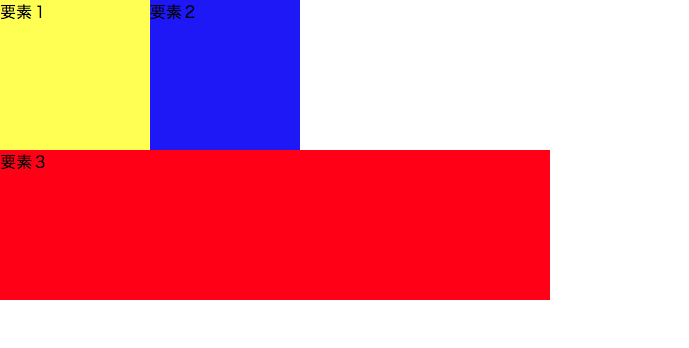

特定の要素だけ `float` プロパティを解除して他の要素は横並びといった、上記の例のようなパターンはよく使用します。

 `float` プロパティと `clear` プロパティはうまく組み合わせて使いこなせるよう、developer toolでClass 2で仕上げたチャレンジの自己紹介ページで練習してみると感覚がつかみやすいです。

## floatによる回り込みを解除する2：clearfix

さて、 `clear` プロパティで全て解決しそうに見えますが、実はそう簡単に解決しない場合も中にはあります。

例えば、先ほどの `clear` プロパティで回り込みを解除できた赤い要素３の上部に少し間隔を50pxほどあける指定をしてみましょう。
 `margin-top: 50px;` を赤い要素３にCSSで書き足せば良さそうなことがわかるので、書き足してどうなるか見てみましょう。

 ```css
 .element1 {
  background-color: yellow;
  width: 150px;
  height: 150px;
  float: left;
 }
 .element2 {
  background-color: blue;
  width: 150px;
  height: 150px;
  float: left;
 }
 .element3 {
  background-color: red;
  width: 550px;
  height: 150px;
  clear: both;
  margin-top: 50px;
 }
 ```


何も変化がなく、赤い要素３の上部がまだ黄色と青の要素と隙間なく配置されたままですね。

実は、`clear` プロパティを与えた要素には `margin-top` が効かないため、このようになってしまうのです。

最近の傾向で、今は `clearfix` で対応する方法が主流になっています。

### - clearfixを使用するために必要な知識：カラム

カラムという概念を理解すると、より `clearfix` を使いやすくなるので、ここで紹介していきます。

もう少し理解しやすくするために、上記の例にもう一つ要素0という要素をヘッダーとして加えて、簡単なWebページの構造にしてみます。

```html
<div class="header">
  要素０：Header
</div>

<div id="wrapper" class="clearfix">
  <div class="main-body">
    要素１：メイン
  </div>
  <div class="sidebar">
    要素２：サイドバー
  </div>
</div>

<div class="footer">
  要素３：Footer
</div>
```

```css
.header {
  background-color: green;
  width: 550px;
  height: 150px;
}
.main-body {
  background-color: yellow;
  width: 400px;
  height: 150px;
  float: left;
}
.sidebar {
  background-color: blue;
  width: 150px;
  height: 150px;
  float: left;
}
.footer {
  background-color: red;
  width: 550px;
  height: 150px;
  clear: both;
  margin-top: 50px;/* clearプロパティで効いていないmargin-top */
}
```

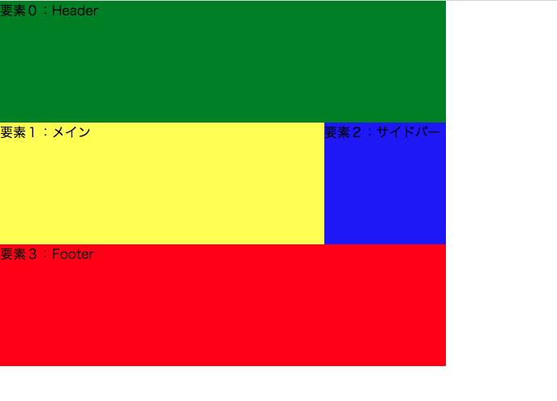

では、カラムについて説明していきます。

上の図のように、ヘッダーとフッターをそれぞれ1分割している要素を1カラムの構造と見なし、メインとサイドバーは、ヘッダーやフッターそれぞれ1つ分の横幅に2分割されて並列していると見なします。

つまり同じ横幅内で何分割されているかということです。

この場合、ヘッダーは1カラム構造、メインとサイドバーを合わせて2カラム構造、フッターは1カラム構造と言います。

また、通常2カラムレイアウトの場合は、上記のHTMLコードのように、2カラム構造の部分（メインとサイドバー）は1つの `div` で大きく囲んでまとめる方法が推奨されます。

## floatによる回り込みを解除する2（続き）：clearfix

カラムの概要が理解できたので、改めて `clearfix` で `margin-top` を有効化させる方法に戻りましょう。

 `clearfix` はclass属性で指定していきます。
HTMLコードで、メインとサイドバーの要素を囲んだ `div` 要素に `class="clearfix"` とclass属性を追加していることに注目してください。

```html
<div class="header">
  要素０：Header
</div>

<div id="wrapper" class="clearfix">
  <div class="main-body">
    要素１：メイン
  </div>
  <div class="sidebar">
    要素２：サイドバー
  </div>
</div>

<div class="footer">
  要素３：Footer
</div>
```

ここからCSSで設定していきます。
まずはどう `clearfix` を書いていくのかを先に見てみましょう。

```css
.clearfix::after {
  content: "";
  display: block;
  clear: both;
}
```

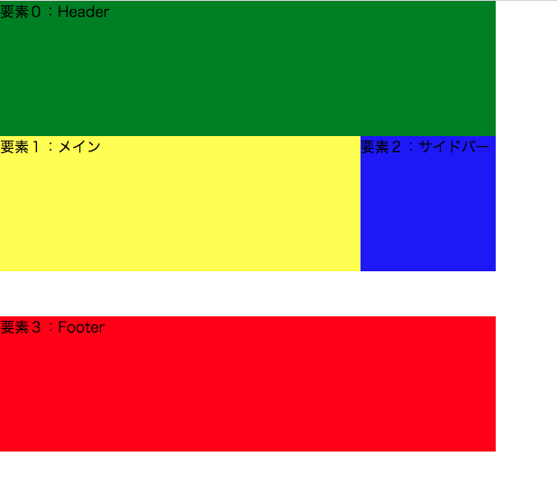

きちんと `margin-top` が有効になっていることも確認できますね。

`.clearfix` に `::after` という`疑似要素`を使うことで、 `class="clearfix"` のかかる要素の終了タグ直後をセレクタとして選択できます。
この場合では、メインとサイドバー要素を囲んでいる `div` 要素のすぐ直後、つまりフッターの上です。

```css
.clearfix::after {
  content: "";/* ここがclearfix::afterに該当する箇所。 */
  display: block;
  clear: both;
}
```

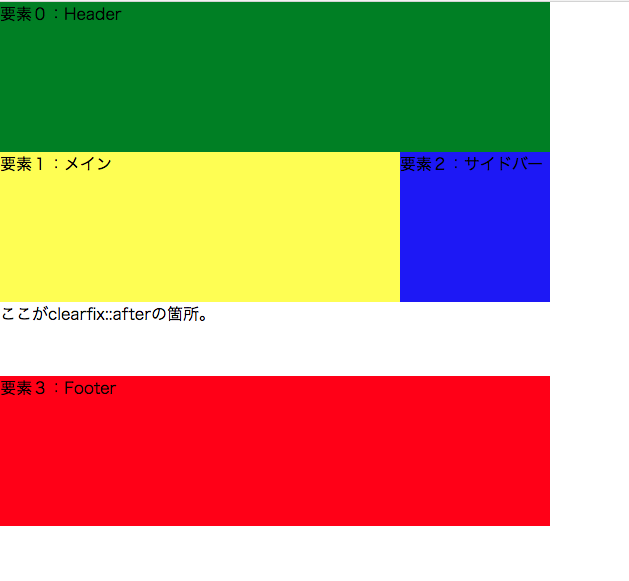

contentプロパティには、値としてテキスト（文字列）を入れるのは推奨されていないので注意しましょう。

## ポジショニングとは？

ポジショニングは、 `position` プロパティで要素の配置、表示のさせ方を指定することができます。

基本的には、 `position` プロパティの値によって要素の位置が変わります。
 `position` の値によっては、 `top` `right` `bottom` `left` のプロパティも付け加えることで、最終的な要素の配置を決めることができます。

### - 予備知識：displayプロパティでも要素の並列は可能

ヘッダーメニューやボタンのような小さいパーツであれば、ポジショニングの `display: inline-block;` で並列させる方法の方が、 `clearfix` も要らないので、コードも短くて済みます。

状況に応じてポジショニングで並列させるのが良いでしょう。

```html
<div class="element1">
  要素１
</div>
<div class="element2">
  要素２
</div>
<div class="element3">
  要素３
</div>
```

```css
.element1 {
  background-color: yellow;
  width: 150px;
  height: 150px;
  display: inline-block;
}
.element2 {
  background-color: blue;
  width: 150px;
  height: 150px;
  display: inline-block;
}
.element3 {
  background-color: red;
  width: 550px;
  height: 150px;
  display: inline-block;
}
```

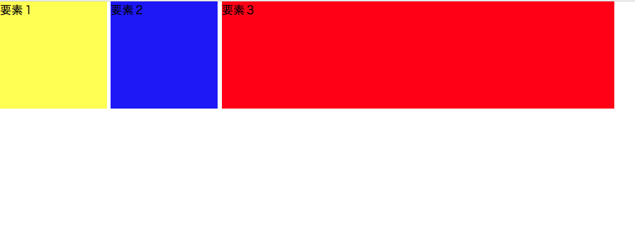

 `display` のポジショニングのプロパティは `inline-block` だけではないのですが、並列させるためには基本的には `inline-block` で効きます。
そのほかの値はdeveloper toolでもCSSの値を変更させることができます。

## positionプロパティ

### - position: static; の場合

中央の青い要素２の配置をコントロールしてみましょう。
HTMLコードは上記と同じで、CSSだけ `position` プロパティを書き加えてみます。

```css
.element1 {
  background-color: yellow;
  width: 150px;
  height: 150px;
  display: inline-block;
}
.element2 {
  background-color: blue;
  width: 150px;
  height: 150px;
  display: inline-block;
  position: static; /* ポジショニングのpositionプロパティはここ */
}
.element3 {
  background-color: red;
  width: 550px;
  height: 150px;
  display: inline-block;
}
```


 `static` が値の場合は、基本的に配置はこの例では変わりません。
 `top` `right` などのプロパティで最終的な要素の配置を変化させようとしても、 `static` では動きません。

### - position: relative; の場合

では、 `position` の値を `relative` にしてみましょう。

```css
.element1 {
  background-color: yellow;
  width: 150px;
  height: 150px;
  display: inline-block;
}
.element2 {
  background-color: blue;
  width: 150px;
  height: 150px;
  display: inline-block;
  /* positionの値によっては、topやleftなどの別のプロパティで要素の最終的な配置を調整できる */
  position: relative;
  top: 65px;
  left: 65px;
}
.element3 {
  background-color: red;
  width: 550px;
  height: 150px;
  display: inline-block;
}
```


 `position: relative;` の場合は、 `top` `left` `right` `bottom` で最終的な要素の配置を調整することができます。
上記のコードは一例ですが、 `top` `left` で中央の青い要素２のみを右下に配置させています。

 `margin` `padding` で調整しているのではなく、 `position` で配置を調整しているので、developer toolでも確認すると、 `margin` `padding` は設定されていないことが確認できます。

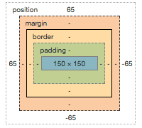

### - position: absolute; の場合

では、 `position` の値を `absolute` にしてみましょう。

```css
.element1 {
  background-color: yellow;
  width: 150px;
  height: 150px;
  display: inline-block;
}
.element2 {
  background-color: blue;
  width: 150px;
  height: 150px;
  display: inline-block;
  /* positionの値によっては、topやleftなどの別のプロパティで要素の最終的な配置を調整できる */
  position: absolute;
  top: 40px;
  left: 40px;
}
.element3 {
  background-color: red;
  width: 550px;
  height: 150px;
  display: inline-block;
}
```


`position: absolute;` の場合も、 `top` `left` `right` `bottom` で最終的な要素の配置を調整することができます。

### - position: sticky; の場合

では、 `position` の値を `sticky` にしてみましょう。

```css
.element1 {
  background-color: yellow;
  width: 150px;
  height: 150px;
  display: inline-block;
}
.element2 {
  background-color: blue;
  width: 150px;
  height: 150px;
  display: inline-block;
  /* positionの値によっては、topやleftなどの別のプロパティで要素の最終的な配置を調整できる */
  position: sticky;
  top: 200px;
  left: 200px;
}
.element3 {
  background-color: red;
  width: 550px;
  height: 150px;
  display: inline-block;
}
```

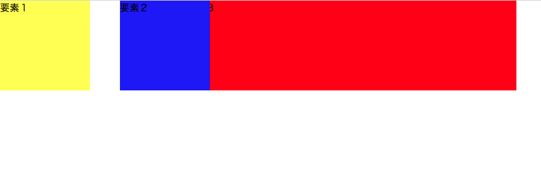

 `top` のプロパティは効いていないのですが、 `left` のプロパティは効いているのがわかりますね。

全ての `position` の値に対して、 いつも `top` などの最終的な要素の配置を定めるプロパティが効くわけではないです。

 `position` のポジショニングは、developer toolで検証しながら一番作成しているケースにあったポジショニングを組み合わせて行くのが望ましいので、わからないこと、うまくいかない場合はdeveloper toolで検証し、MDNなどの公式ドキュメントで確認して行くようにして行くと感覚がつかめます。

## z-indexプロパティ

 `z-index` プロパティは簡単にいうと要素の重なりの優先順位を決めるプロパティです。
Webページをよく平面として捉えがちですが、 `float` プロパティで要素を「浮かせる」状態にすることのように、要素自体の重なりの高さを調整するプロパティです。

数学の関数でx軸、y軸、z軸を習った時に、z軸は立体の奥行きを表す関数と習いますが、 `z-index` もそのように認識すると理解しやすいです。

 `z-index` は値を整数で表記します。
高さを設定しない最小値は `0` で、数字が大きくなるにつれ、その要素の「浮く」高さが変化します。

 `z-index` を実際に設定する前に以下の項目に気をつける必要があります。

```
- 要素は通常何も設定しない状態であれば基本的には `0` の高さに存在。

- `z-index` を使用するときは、その要素自体の `position` のプロパティが `static` 以外になっていることが条件。

- `z-index` の値が `auto` の場合は、親要素と同じ `z-index` の値が与えられる。

- `z-index` をどこにも設定していない場合は、ソース内で後に記述されたものほど手前に配置される。
```

では、要点は抑えられたので、実際に `z-index` を使用してみましょう。

```html
<div class="element1">
  要素１
</div>
<div class="element2">
  要素２
</div>
<div class="element3">
  要素３
</div>
```

```css
.element1 {
  background-color: yellow;
  width: 150px;
  height: 150px;
  display: inline-block;
  /* 何も設定していないので、z-indexの値は0になる */
}
.element2 {
  background-color: blue;
  width: 150px;
  height: 150px;
  display: inline-block;
  position: absolute;/* これからz-indexを設定するのでstatic以外の値で設定 */
  top: 50px;
  left: 50px;
  /* 何も設定していないが、ソース内で後に記述されているので、要素１よりは上に重なる */
}
.element3 {
  background-color: red;
  width: 550px;
  height: 150px;
  display: inline-block;
  position: absolute;/* これからz-indexを設定するのでstatic以外の値で設定 */
  top: 100px;
  left: 100px;
  /* 何も設定していないが、ソース内で後に記述されているので、要素２よりは上に重なる */
}
```


上記のように、 `z-index` を設定していなくても、後に書かれた要素はどんどん手前に重なっていくので、要素１が一番重なりの下になります。

重なりの順序を変えるために、 `z-index` で指定してみましょう。

```html
<div class="element1">
  要素１
</div>
<div class="element2">
  要素２
</div>
<div class="element3">
  要素３
</div>
```

```css
.element1 {
  background-color: yellow;
  width: 150px;
  height: 150px;
  display: inline-block;
  /* 何も設定していないので、z-indexの値は0になる */
}
.element2 {
  background-color: blue;
  width: 150px;
  height: 150px;
  display: inline-block;
  position: absolute;/* これからz-indexを設定するのでstatic以外の値で設定 */
  top: 50px;
  left: 50px;
  z-index: 2;/* 値は整数で設定 */
}
.element3 {
  background-color: red;
  width: 550px;
  height: 150px;
  display: inline-block;
  position: absolute;/* これからz-indexを設定するのでstatic以外の値で設定 */
  top: 100px;
  left: 100px;
  z-index: 1;/* 値は整数で設定 */
}
```


重なりの順番が変わり、青い要素２が全ての重なりの中で一番上に重なっていますね。
これは `z-index` の値がもっとも大きな整数の値に設定され、 `position` プロパティが `static` 以外の値になっているためです。

ではもう少し複雑にしてみましょう。
今までの３つの要素よりもさらに上に文字を重ねてみます。
この方法は実際のWebサイトでもよく見かけます。
画像や要素に文字を重ねる方法は、ほとんどのWebサイトにあると言っても過言ではないでしょう。

```html
<div class="element1">
  要素１
</div>
<h2>テキストを一番上の重なりにする</h2>
<div class="element2">
  要素２
</div>
<div class="element3">
  要素３
</div>
```

```css
.element1 {
  background-color: yellow;
  width: 150px;
  height: 150px;
  display: inline-block;
  /* 何も設定していないので、z-indexの値は0になる */
}

h2 {
  color: white;
  position: relative;/* absoluteでいつもうまくいくとは限らない */
  bottom: 50px;
  left: 50px;
  z-index: 3;/* 値は整数で設定 */
}

.element2 {
  background-color: blue;
  width: 150px;
  height: 150px;
  display: inline-block;
  position: absolute;/* これからz-indexを設定するのでstatic以外の値で設定 */
  top: 50px;
  left: 50px;
  z-index: 2;/* 値は整数で設定 */
}
.element3 {
  background-color: red;
  width: 550px;
  height: 150px;
  display: inline-block;
  position: absolute;/* これからz-indexを設定するのでstatic以外の値で設定 */
  top: 100px;
  left: 100px;
  z-index: 1;/* 値は整数で設定 */
}
```

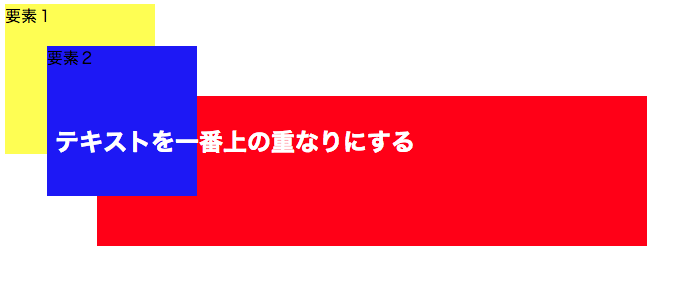

意図した通り、文字が一番重なりの上になりました。
一つ注意して欲しいのが、 `position` の値はいつも `absolute` で良いとは限りません。
今回の例も `absolute` ではうまく重なりが表現できなかったため、別の `relative` という値で表示されるようにしています。

 `z-index` はこの `position` の値でうまくいったり、う
まくいかなかったりするので、値を変えながらうまくいく値の組み合わせを見つけていくのがコツです。

## マージンの相殺（margin collapse）

マージンの相殺とは、上下隣り合わせの要素では `top` と `bottom` のマージンが相殺され、結合されることがある現象のことを言います。

基本的には結合されるマージンのうち、値が大きい方のマージンに結合され、値の小さい方のマージンは相殺されてなくなります。

簡単な例をあげると、以下の様な `<p>` タグ要素の上下隣り合った `top` と `bottom` マージンは相殺されています。

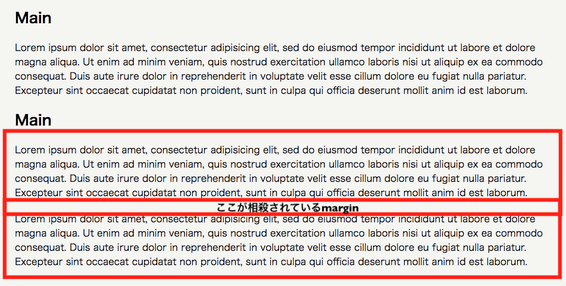

```html
<div class="main-body">
  <h2>Main</h2>
  <p>Lorem ipsum dolor sit amet, consectetur adipisicing elit, sed do eiusmod tempor incididunt ut labore et dolore magna aliqua. Ut enim ad minim veniam, quis nostrud exercitation ullamco laboris nisi ut aliquip ex ea commodo consequat. Duis aute irure dolor in reprehenderit in voluptate velit esse cillum dolore eu fugiat nulla pariatur. Excepteur sint occaecat cupidatat non proident, sunt in culpa qui officia deserunt mollit anim id est laborum.</p>
  <h2>Main</h2>
  <p>Lorem ipsum dolor sit amet, consectetur adipisicing elit, sed do eiusmod tempor incididunt ut labore et dolore magna aliqua. Ut enim ad minim veniam, quis nostrud exercitation ullamco laboris nisi ut aliquip ex ea commodo consequat. Duis aute irure dolor in reprehenderit in voluptate velit esse cillum dolore eu fugiat nulla pariatur. Excepteur sint occaecat cupidatat non proident, sunt in culpa qui officia deserunt mollit anim id est laborum.</p>
  <!-- ちょうどこの箇所のmarginのtopとbottomが相殺され、40pxではなく、20pxになっている -->
  <p>Lorem ipsum dolor sit amet, consectetur adipisicing elit, sed do eiusmod tempor incididunt ut labore et dolore magna aliqua. Ut enim ad minim veniam, quis nostrud exercitation ullamco laboris nisi ut aliquip ex ea commodo consequat. Duis aute irure dolor in reprehenderit in voluptate velit esse cillum dolore eu fugiat nulla pariatur. Excepteur sint occaecat cupidatat non proident, sunt in culpa qui officia deserunt mollit anim id est laborum.</p>
</div>
```

```css
.main-body p {
  margin: 20px 0 20px 0;
}
```

## box-sizing: border-box

`padding` や `border` で微調整しながらそれぞれの要素ごとの横幅のバランスや並列をさせようとすると、思わぬところに要素が配置されていたり、横幅が予想しない長さではみ出していたりすることがあります。

`padding` や `border` で微調整しても良いのですが、あまり効率の良いやり方ではない上に、時間もかかってしまいます。

そこで、`padding` や `border` に依存せずに `width` や `height` を意図した通りに指定することのできる方法を使います。

 `box-sizing: border-box` を `padding` や `border-width` プロパティのある要素に指定すると、思い通りの `width` や `height` で並列してくれたり、長さが飛び出ることがなくなったり、意図した通りに要素を配置させることができます。

使い方は簡単で、 `padding` や `border-width` のかかっている要素に、 `box-sizing: border-box` も一緒にCSSに書くことで有効になります。

```html
<div class="header">
  <h4>ヘッダー</h4>
</div>

<div id="wrapper" class="clearfix">
  <div class="main-body">
    <h2>メイン</h2>
    <p>これはメインです</p>
  </div>
</div>
```

```css
.header {
  background-color: red;
  width: 1280px;
  height: 50px;
  padding: 13px 10px 10px 10px;
  box-sizing: border-box;/* paddingの値がこのままでもborder-boxで並列する */
}

.main-body {
  background-color: blue;
  width: 1000px;
  height: 530px;
  padding: 13px 10px 10px 10px;
  box-sizing: border-box;/* paddingの値がこのままでもborder-boxで並列する */
}
```

## まとめ

今までこのクラスで学んできた `float` やポジショニングについて、以下のプロパティの一覧で簡単におさらいしてみましょう。

| 表示と配置関係 | 指定の種類 |
| ------------- | -----:|
| float | 左か右に寄せて表示させる指定 |
| clear | 要素回り込み解除の指定 |
| display | 要素の表示の仕方の指定 |
| position | ボックスの配置方法の指定 |
| z-index | 要素の重なり方の順序指定 |

## チャレンジ

[チャレンジ3](./challenge/README.md)


## 更に学ぼう

### 記事で学ぶ

- [floats - MDN(英語)](https://developer.mozilla.org/en-US/docs/Learn/CSS/CSS_layout/Floats)
- [CSS floatを初心者向けに図で解説　抑えるべき注意点とは？](https://udemy.benesse.co.jp/development/css-float.html)
- [Positioniing - MDN(英語)](https://developer.mozilla.org/en-US/docs/Learn)
- [マージンの相殺 - MDN](https://developer.mozilla.org/ja/docs/Web/CSS/CSS_Box_Model/Mastering_margin_collapsing)
- [box-sizing - MDN](https://developer.mozilla.org/ja/docs/Web/CSS/box-sizing)

### 動画で学ぶ

- [CSS入門 #20~#23 - ドットインストール](https://dotinstall.com/lessons/basic_css_v3)
