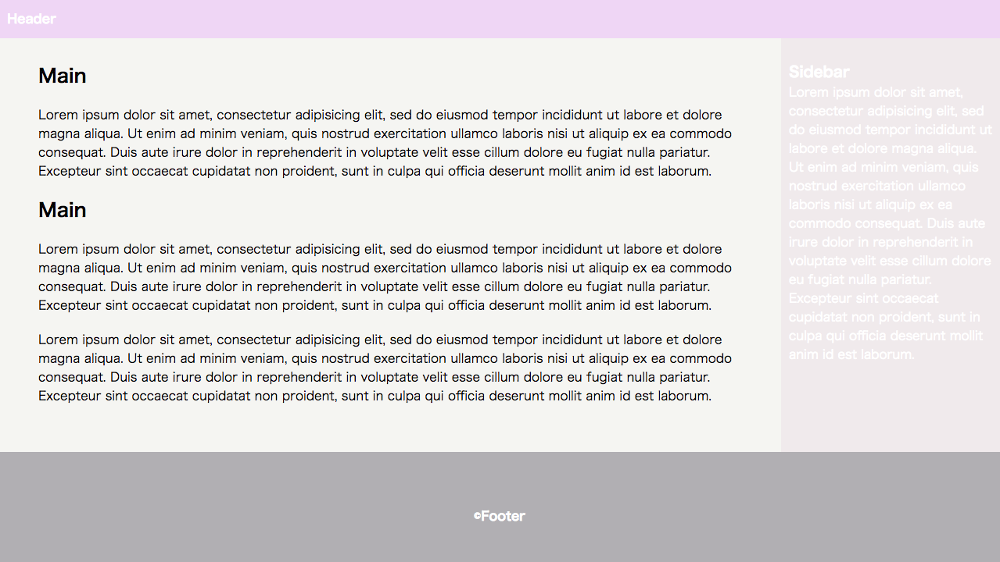

# チャレンジ3

```
所要時間: 30分
ステータス: 公開
タイプ: 課題
```

## 目的

- floatの仕組みを理解する。
- 基本的なfloatでスタイルを調整できるようになる。
- ポジショニング(position: absolute | relative | static, z-index)が使えるようになる

## チャレンジの取り組み方

1. マイルストーンごとに要件に合うようにファイルを編集していきます。
2. 分からない部分があれば、テキストを復習して、再度チャレンジしてみましょう。
3. 再チャレンジしてしばらく考えても分からない場合はチャットでメンターに質問しましょう。
4. 完成したら、Dropboxでメンターとファイルを共有して下さい。
5. メンターから課題レビューが届きます。
6. ビデオチャットの際は、分からない点を更に突っ込んで聞いたり、より良い書き方を聞いてみましょう。

## 概要

簡素なWebサイト構成（ヘッダー、コンテンツ、サイドバー、フッター）を以下の要件を満たしながら作りましょう。完成の例は以下の画像の様になります。




## スターターファイル

以下のスターターファイルをテンプレートとして利用して下さい。

- [codegrit-html-css-ch03-starter](https://github.com/codegrit-jp-students/codegrit-html-css-ch03-starter)

## マイルストーン1

### 要件

- `padding` 指定のある要素でも、`width`で指定した幅通りで並列するようにする。
- clearを使って、コンテンツ、サイドバー、フッターの周り込みを解除する。
- メインコンテンツの右側にサイドバーを表示する。

### ヒント

- `box-sizing: border-box`を設定した時と、しない時とを比べてみましょう。

## 評価

課題の後、以下の２つについてメンターにフィードバックをお願いします。

1. 要件のカバー度: 1.全く出来なかった 2.ほとんど出来なかった 3. 半分ほどは出来た 4.8割ほどは出来た 5. 全部出来た
2. 難易度: 1. とても難しかった 2. 難しかった 3. ちょうど良かった 4. 簡単だった 5. とても簡単だった
