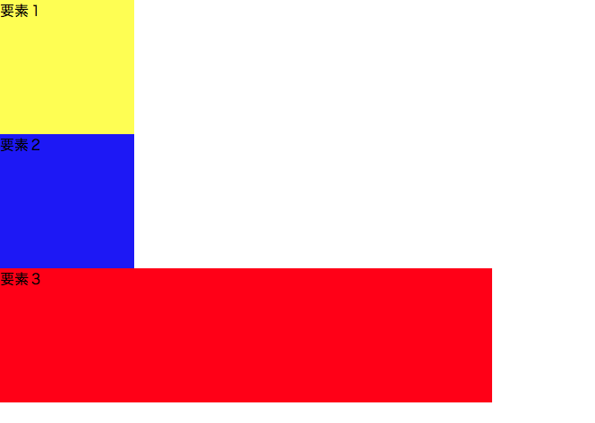
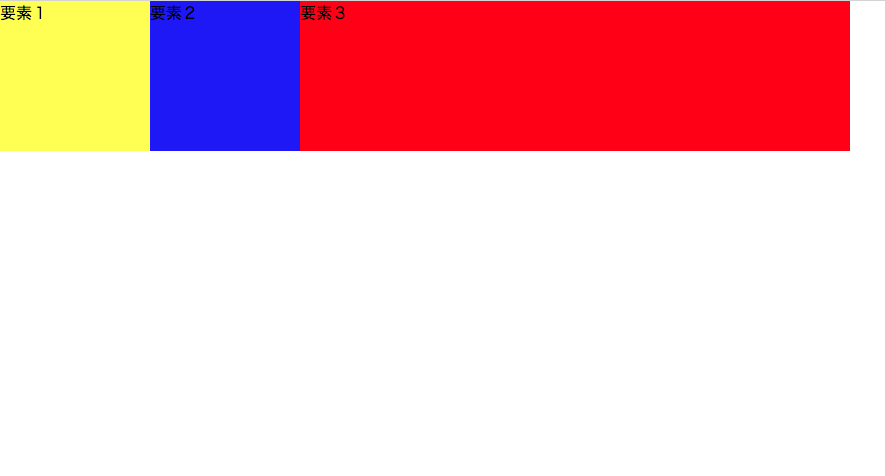

## floatとは？

`float` とは、簡単に説明すると、縦並びの要素を横並びにすることができるプロパティのことです。

CSSのプロパティである `float` は、要素が右か左に配置されるよう、コンテンツ内で特定します。
`p` などのテキストやインライン要素があれば、 `float` で右か左に配置された要素の周りを囲むようにテキストやインライン要素が配置されます。

## floatプロパティの書き方

`float` プロパティの書き方は非常に簡単です。

```css
float: 値;
```

これで基本的には横並びにさせたい要素を指定し、横並び表示にすることができます。

`float` で指定できる値には以下の3つがあります。

| floatで指定できる値 | 指定の種類 |
| ------------- | -----:|
| right | 要素を右寄せに指定 |
| left | 要素を左寄せに指定 |
| none | 指定なし（ほぼ使わない） |


### floatプロパティの実践

実際にHTMLと組み合わせて `float` で要素のスタイルを指定してみましょう。
まず、HTMLとCSSで3つの要素を用意します。

```html
<div class="element1">
  要素１
</div>
<div class="element2">
  要素２
</div>
<div class="element3">
  要素３
</div>
```

```css
.element1 {
  background-color: yellow;
  width: 150px;
  height: 150px;
}
.element2 {
  background-color: blue;
  width: 150px;
  height: 150px;
}
.element3 {
  background-color: red;
  width: 550px;
  height: 150px;
}
```



<iframe width="100%" height="300" src="//jsfiddle.net/codegrit_hiro/6vf34nkb/embedded/html,css,result/dark/" allowfullscreen="allowfullscreen" allowpaymentrequest frameborder="0"></iframe>

では、CSSで `float` プロパティを使って以下のようにそれぞれの要素にスタイルを指定していきます。

```css
.element1 {
  background-color: yellow;
  width: 150px;
  height: 150px;
  float: left;
}
.element2 {
  background-color: blue;
  width: 150px;
  height: 150px;
  float: left;
}
.element3 {
  background-color: red;
  width: 550px;
  height: 150px;
  float: left;
}
```



<iframe width="100%" height="300" src="//jsfiddle.net/codegrit_hiro/mtL14v97/1/embedded/html,css,result/dark/" allowfullscreen="allowfullscreen" allowpaymentrequest frameborder="0"></iframe>

 `float: left;` と `float` プロパティで全ての要素を左寄せに配列させたので、要素3つともが横並びになりました。(ならない場合は画面幅を広げてみてください。)