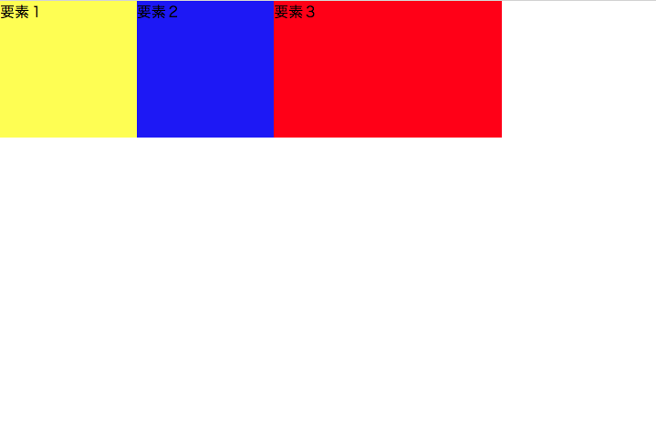
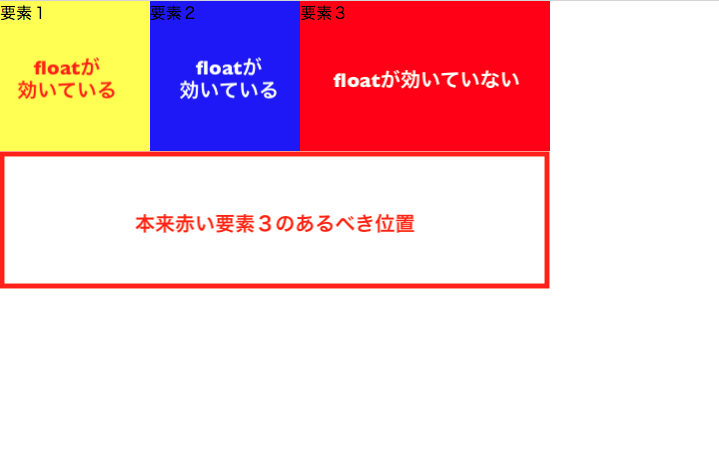
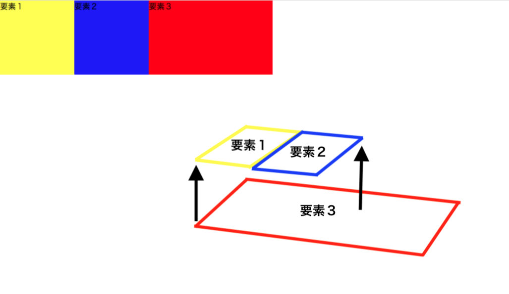
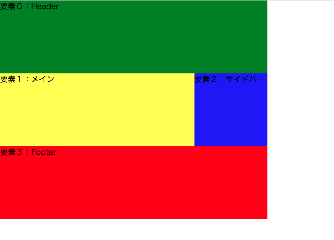
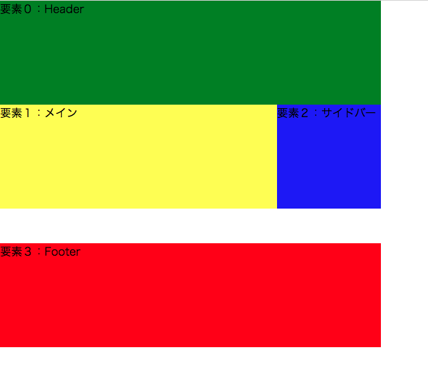
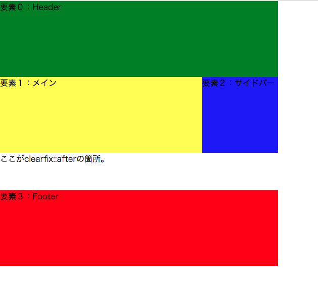

## floatによる回り込みの問題

CSSでページをスタイルしていくにあたり、HTMLだけではできない `float` による要素の横並びはとても便利です。

ただし、 `float` には少しだけ注意すべきことがあります。
赤い要素３の `float` プロパティだけを試しに外してみるとどうなるか見てみましょう。

```css
.element1 {
  background-color: yellow;
  width: 150px;
  height: 150px;
  float: left;
}
.element2 {
  background-color: blue;
  width: 150px;
  height: 150px;
  float: left;
}
.element3 {
  background-color: red;
  width: 550px;
  height: 150px;
}
```



先ほどの全ての要素に `float` プロパティを左寄せで指定していた時と比べて、赤い要素の横幅が短くなっています。
そして、 `float` プロパティを赤い要素３だけ外しているのに、赤い要素はまだ横並びのままです。
一体どういうことなのでしょうか？



平面で見るとわからないのですが、 `float` プロパティのついた要素は、意味どおり、「浮く」状態になります。

先ほどの状態を平面ではなく、立体でとらえると理解できます。



つまり、 `float` プロパティのついた黄色い要素１と青い要素２が浮いていて、その背後に赤い要素３が回り込んでいるということなのです。

ブラウザでは、真正面から見ていることになるので、赤い要素３の横幅が縮小し、本来位置すべき黄色い要素１と青い要素２の下に位置しないという現象のように見えるということです。

## floatによる回り込みを解除する1：clearプロパティ

 `float` による要素が背後に回り込む現象を防ぐには、以下のように赤い要素３、つまり `float` プロパティのついていない要素に設定すると解除することができます。

```css
clear: both;
```

この設定を `clearプロパティ` と言います。
 `clearプロパティ` を指定することで、 `float` プロパティのついた黄色い要素１と青い要素２の背後に回り込まないので、赤い要素３は以下のように本来意図した位置に配置されるようになります。

 `clear` プロパティはほとんどの場合が `both` が値で問題ないです。


 ```css
 .element1 {
  background-color: yellow;
  width: 150px;
  height: 150px;
  float: left;
 }
 .element2 {
  background-color: blue;
  width: 150px;
  height: 150px;
  float: left;
 }
 .element3 {
  background-color: red;
  width: 550px;
  height: 150px;
  clear: both;
 }
 ```


特定の要素だけ `float` プロパティを解除して他の要素は横並びといった、上記の例のようなパターンはよく使用します。

 `float` プロパティと `clear` プロパティはうまく組み合わせて使いこなせるよう、developer toolでClass 2で仕上げたチャレンジの自己紹介ページで練習してみると感覚がつかみやすいです。

[サンプルコード](https://github.com/codegrit-jp-students/codegrit-html-css-lesson03-sample-float)

## floatによる回り込みを解除する2：clearfix

さて、 `clear` プロパティで全て解決しそうに見えますが、実はそう簡単に解決しない場合も中にはあります。

例えば、先ほどの `clear` プロパティで回り込みを解除できた赤い要素３の上部に少し間隔を50pxほどあける指定をしてみましょう。
 `margin-top: 50px;` を赤い要素３にCSSで書き足せば良さそうなことがわかるので、書き足してどうなるか見てみましょう。

 ```css
 .element1 {
  background-color: yellow;
  width: 150px;
  height: 150px;
  float: left;
 }
 .element2 {
  background-color: blue;
  width: 150px;
  height: 150px;
  float: left;
 }
 .element3 {
  background-color: red;
  width: 550px;
  height: 150px;
  clear: both;
  margin-top: 50px;
 }
 ```


何も変化がなく、赤い要素３の上部がまだ黄色と青の要素と隙間なく配置されたままですね。

実は、`clear` プロパティを与えた要素には `margin-top` が効かないため、このようになってしまうのです。

最近の傾向で、今は `clearfix` で対応する方法が主流になっています。

### - clearfixを使用するために必要な知識：カラム

カラムという概念を理解すると、より `clearfix` を使いやすくなるので、ここで紹介していきます。

もう少し理解しやすくするために、上記の例にもう一つ要素0という要素をヘッダーとして加えて、簡単なWebページの構造にしてみます。

```html
<div class="header">
  要素０：Header
</div>

<div id="wrapper" class="clearfix">
  <div class="main-body">
    要素１：メイン
  </div>
  <div class="sidebar">
    要素２：サイドバー
  </div>
</div>

<div class="footer">
  要素３：Footer
</div>
```

```css
.header {
  background-color: green;
  width: 550px;
  height: 150px;
}
.main-body {
  background-color: yellow;
  width: 400px;
  height: 150px;
  float: left;
}
.sidebar {
  background-color: blue;
  width: 150px;
  height: 150px;
  float: left;
}
.footer {
  background-color: red;
  width: 550px;
  height: 150px;
  clear: both;
  margin-top: 50px;/* clearプロパティで効いていないmargin-top */
}
```



では、カラムについて説明していきます。

上の図のように、ヘッダーとフッターをそれぞれ1分割している要素を1カラムの構造と見なし、メインとサイドバーは、ヘッダーやフッターそれぞれ1つ分の横幅に2分割されて並列していると見なします。

つまり同じ横幅内で何分割されているかということです。

この場合、ヘッダーは1カラム構造、メインとサイドバーを合わせて2カラム構造、フッターは1カラム構造と言います。

また、通常2カラムレイアウトの場合は、上記のHTMLコードのように、2カラム構造の部分（メインとサイドバー）は1つの `div` で大きく囲んでまとめる方法が推奨されます。

## floatによる回り込みを解除する2（続き）：clearfix

カラムの概要が理解できたので、改めて `clearfix` で `margin-top` を有効化させる方法に戻りましょう。

 `clearfix` はclass属性で指定していきます。
HTMLコードで、メインとサイドバーの要素を囲んだ `div` 要素に `class="clearfix"` とclass属性を追加していることに注目してください。

```html
<div class="header">
  要素０：Header
</div>

<div id="wrapper" class="clearfix">
  <div class="main-body">
    要素１：メイン
  </div>
  <div class="sidebar">
    要素２：サイドバー
  </div>
</div>

<div class="footer">
  要素３：Footer
</div>
```

ここからCSSで設定していきます。
まずはどう `clearfix` を書いていくのかを先に見てみましょう。

```css
.clearfix::after {
  content: "";
  display: block;
  clear: both;
}
```



きちんと `margin-top` が有効になっていることも確認できますね。

`.clearfix` に `::after` という`疑似要素`を使うことで、 `class="clearfix"` のかかる要素の終了タグ直後をセレクタとして選択できます。
この場合では、メインとサイドバー要素を囲んでいる `div` 要素のすぐ直後、つまりフッターの上です。

```css
.clearfix::after {
  content: "";/* ここがclearfix::afterに該当する箇所。 */
  display: block;
  clear: both;
}
```



contentプロパティには、値としてテキスト（文字列）を入れるのは推奨されていないので注意しましょう。

[サンプルコード](https://github.com/codegrit-jp-students/codegrit-html-css-lesson03-sample-column)
