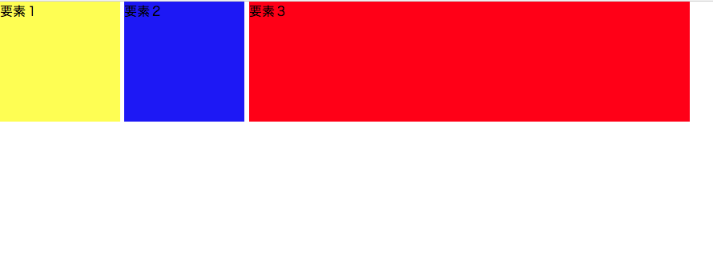
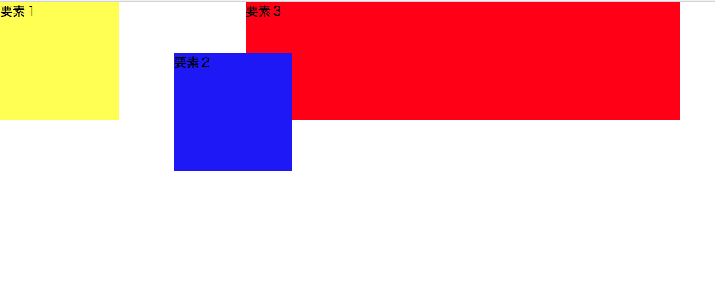
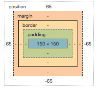
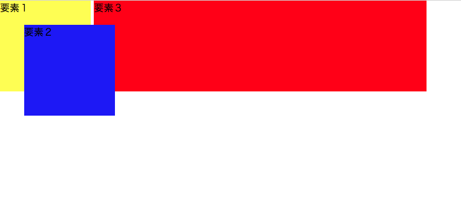
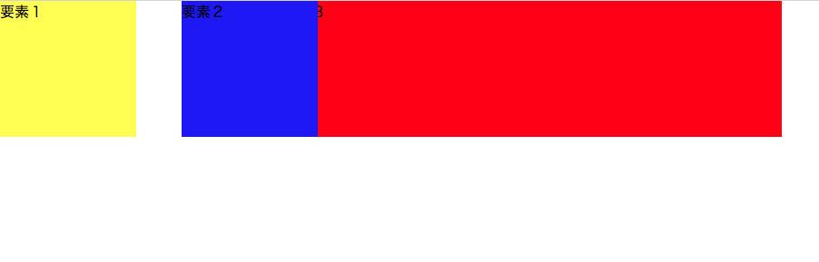

## ポジショニングとは？

ポジショニングは、`position`プロパティで要素の配置、表示のさせ方を指定することができます。

基本的には、`position`プロパティの値によって要素の位置が変わります。
`position`の値によっては、`top`、`right`、`bottom`、`left`のプロパティも付け加えることで、最終的な要素の配置を決めることができます。

### - 予備知識：displayプロパティでも要素の並列は可能

ヘッダーメニューやボタンのような小さいパーツであれば、ポジショニングの`display: inline-block;`で並列させる方法の方が、`clearfix`も要らないので、コードも短くて済みます。

状況に応じてポジショニングで並列させるのが良いでしょう。

```html
<div class="element1">
  要素１
</div>
<div class="element2">
  要素２
</div>
<div class="element3">
  要素３
</div>
```

```css
.element1 {
  background-color: yellow;
  width: 150px;
  height: 150px;
  display: inline-block;
}

.element2 {
  background-color: blue;
  width: 150px;
  height: 150px;
  display: inline-block;
}

.element3 {
  background-color: red;
  width: 550px;
  height: 150px;
  display: inline-block;
}
```



<iframe width="100%" height="300" src="//jsfiddle.net/codegrit_hiro/8xs7hz6b/embedded/html,css,result/dark/" allowfullscreen="allowfullscreen" allowpaymentrequest frameborder="0"></iframe>

`display`のポジショニングのプロパティは`inline-block`だけではないのですが、並列させるためには基本的には`inline-block`で効きます。
そのほかの値はdeveloper toolでもCSSの値を変更させることができます。

## positionプロパティ

### - position: static; の場合

中央の青い要素２の配置をコントロールしてみましょう。
HTMLコードは上記と同じで、CSSだけ`position`プロパティを書き加えてみます。

```css
.element1 {
  background-color: yellow;
  width: 150px;
  height: 150px;
  display: inline-block;
}
.element2 {
  background-color: blue;
  width: 150px;
  height: 150px;
  display: inline-block;
  position: static; /* ポジショニングのpositionプロパティはここ */
}
.element3 {
  background-color: red;
  width: 550px;
  height: 150px;
  display: inline-block;
}
```


<iframe width="100%" height="300" src="//jsfiddle.net/codegrit_hiro/ej329ws1/1/embedded/html,css,result/dark/" allowfullscreen="allowfullscreen" allowpaymentrequest frameborder="0"></iframe>

`static`が値の場合は、基本的に配置はこの例では変わりません。
`top``right`などのプロパティで最終的な要素の配置を変化させようとしても、`static`では動きません。

### - position: relative; の場合

では、`position`の値を`relative`にしてみましょう。

```css
.element1 {
  background-color: yellow;
  width: 150px;
  height: 150px;
  display: inline-block;
}
.element2 {
  background-color: blue;
  width: 150px;
  height: 150px;
  display: inline-block;
  /* positionの値によっては、topやleftなどの別のプロパティで要素の最終的な配置を調整できる */
  position: relative;
  top: 65px;
  left: 65px;
}
.element3 {
  background-color: red;
  width: 550px;
  height: 150px;
  display: inline-block;
}
```



<iframe width="100%" height="300" src="//jsfiddle.net/codegrit_hiro/cfbv7j36/2/embedded/html,css,result/dark/" allowfullscreen="allowfullscreen" allowpaymentrequest frameborder="0"></iframe>

`position: relative;`の場合は、`top`、`left`、`right`、`bottom`で最終的な要素の配置を調整することができます。
上記のコードは一例ですが、`top`、`left`で中央の青い要素２のみを右下に配置させています。

`margin`、`padding`で調整しているのではなく、`position`で配置を調整しているので、developer toolでも確認すると、`margin`、`padding`は設定されていないことが確認できます。



### - position: absolute; の場合

では、`position`の値を`absolute`にしてみましょう。

```css
.element1 {
  background-color: yellow;
  width: 150px;
  height: 150px;
  display: inline-block;
}
.element2 {
  background-color: blue;
  width: 150px;
  height: 150px;
  display: inline-block;
  /* positionの値によっては、topやleftなどの別のプロパティで要素の最終的な配置を調整できる */
  position: absolute;
  top: 40px;
  left: 40px;
}
.element3 {
  background-color: red;
  width: 550px;
  height: 150px;
  display: inline-block;
}
```



<iframe width="100%" height="300" src="//jsfiddle.net/codegrit_hiro/2pfadtwb/1/embedded/html,css,result/dark/" allowfullscreen="allowfullscreen" allowpaymentrequest frameborder="0"></iframe>

`position: absolute;`の場合も、`top``left``right``bottom`で最終的な要素の配置を調整することができます。

### - position: sticky; の場合

では、`position`の値を`sticky`にしてみましょう。

```css
.element1 {
  background-color: yellow;
  width: 150px;
  height: 150px;
  display: inline-block;
}
.element2 {
  background-color: blue;
  width: 150px;
  height: 150px;
  display: inline-block;
  /* positionの値によっては、topやleftなどの別のプロパティで要素の最終的な配置を調整できる */
  position: sticky;
  top: 200px;
  left: 200px;
}
.element3 {
  background-color: red;
  width: 550px;
  height: 150px;
  display: inline-block;
}
```



<iframe width="100%" height="300" src="//jsfiddle.net/codegrit_hiro/hefmwn06/1/embedded/html,css,result/dark/" allowfullscreen="allowfullscreen" allowpaymentrequest frameborder="0"></iframe>

`top`のプロパティは効いていないのですが、`left`のプロパティは効いているのがわかりますね。

全ての`position`の値に対して、 いつも`top`などの最終的な要素の配置を定めるプロパティが効くわけではないです。

`position`のポジショニングは、developer toolで検証しながら一番作成しているケースにあったポジショニングを組み合わせて行くのが望ましいので、わからないこと、うまくいかない場合はdeveloper toolで検証し、MDNなどの公式ドキュメントで確認して行くようにして行くと感覚がつかめます。

 [サンプルコード](https://github.com/codegrit-jp-students/codegrit-html-css-lesson03-sample-position)