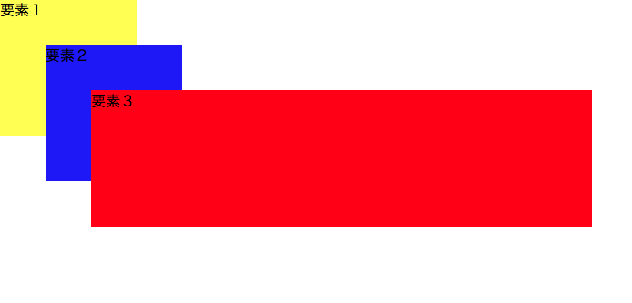
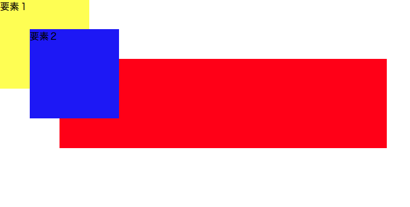
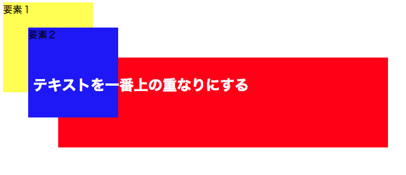

## z-indexプロパティ

 `z-index` プロパティは簡単にいうと要素の重なりの優先順位を決めるプロパティです。
Webページをよく平面として捉えがちですが、 `float` プロパティで要素を「浮かせる」状態にすることのように、要素自体の重なりの高さを調整するプロパティです。

数学の関数でx軸、y軸、z軸を習った時に、z軸は立体の奥行きを表す関数と習いますが、 `z-index` もそのように認識すると理解しやすいです。

 `z-index` は値を整数で表記します。
高さを設定しない最小値は `0` で、数字が大きくなるにつれ、その要素の「浮く」高さが変化します。

 `z-index` を実際に設定する前に以下の項目に気をつける必要があります。

```
- 要素は通常何も設定しない状態であれば基本的には `0` の高さに存在。

- `z-index` を使用するときは、その要素自体の `position` のプロパティが `static` 以外になっていることが条件。

- `z-index` の値が `auto` の場合は、親要素と同じ `z-index` の値が与えられる。

- `z-index` をどこにも設定していない場合は、ソース内で後に記述されたものほど手前に配置される。
```

では、要点は抑えられたので、実際に `z-index` を使用してみましょう。

```html
<div class="element1">
  要素１
</div>
<div class="element2">
  要素２
</div>
<div class="element3">
  要素３
</div>
```

```css
.element1 {
  background-color: yellow;
  width: 150px;
  height: 150px;
  display: inline-block;
  /* 何も設定していないので、z-indexの値は0になる */
}
.element2 {
  background-color: blue;
  width: 150px;
  height: 150px;
  display: inline-block;
  position: absolute;/* これからz-indexを設定するのでstatic以外の値で設定 */
  top: 50px;
  left: 50px;
  /* 何も設定していないが、ソース内で後に記述されているので、要素１よりは上に重なる */
}
.element3 {
  background-color: red;
  width: 550px;
  height: 150px;
  display: inline-block;
  position: absolute;/* これからz-indexを設定するのでstatic以外の値で設定 */
  top: 100px;
  left: 100px;
  /* 何も設定していないが、ソース内で後に記述されているので、要素２よりは上に重なる */
}
```



<iframe width="100%" height="300" src="//jsfiddle.net/codegrit_hiro/yd4fu30o/embedded/html,css,result/dark/" allowfullscreen="allowfullscreen" allowpaymentrequest frameborder="0"></iframe>

上記のように、 `z-index` を設定していなくても、後に書かれた要素はどんどん手前に重なっていくので、要素１が一番重なりの下になります。

重なりの順序を変えるために、 `z-index` で指定してみましょう。

```html
<div class="element1">
  要素１
</div>
<div class="element2">
  要素２
</div>
<div class="element3">
  要素３
</div>
```

```css
.element1 {
  background-color: yellow;
  width: 150px;
  height: 150px;
  display: inline-block;
  /* 何も設定していないので、z-indexの値は0になる */
}
.element2 {
  background-color: blue;
  width: 150px;
  height: 150px;
  display: inline-block;
  position: absolute;/* これからz-indexを設定するのでstatic以外の値で設定 */
  top: 50px;
  left: 50px;
  z-index: 2;/* 値は整数で設定 */
}
.element3 {
  background-color: red;
  width: 550px;
  height: 150px;
  display: inline-block;
  position: absolute;/* これからz-indexを設定するのでstatic以外の値で設定 */
  top: 100px;
  left: 100px;
  z-index: 1;/* 値は整数で設定 */
}
```



<iframe width="100%" height="300" src="//jsfiddle.net/codegrit_hiro/1k54qrey/embedded/html,css,result/dark/" allowfullscreen="allowfullscreen" allowpaymentrequest frameborder="0"></iframe>

重なりの順番が変わり、青い要素２が全ての重なりの中で一番上に重なっていますね。
これは `z-index` の値がもっとも大きな整数の値に設定され、 `position` プロパティが `static` 以外の値になっているためです。

ではもう少し複雑にしてみましょう。
今までの３つの要素よりもさらに上に文字を重ねてみます。
この方法は実際のWebサイトでもよく見かけます。
画像や要素に文字を重ねる方法は、ほとんどのWebサイトにあると言っても過言ではないでしょう。

```html
<div class="element1">
  要素１
</div>
<h2>テキストを一番上の重なりにする</h2>
<div class="element2">
  要素２
</div>
<div class="element3">
  要素３
</div>
```

```css
.element1 {
  background-color: yellow;
  width: 150px;
  height: 150px;
  display: inline-block;
  /* 何も設定していないので、z-indexの値は0になる */
}

h2 {
  color: white;
  position: relative;/* absoluteでいつもうまくいくとは限らない */
  bottom: 50px;
  left: 50px;
  z-index: 3;/* 値は整数で設定 */
}

.element2 {
  background-color: blue;
  width: 150px;
  height: 150px;
  display: inline-block;
  position: absolute;/* これからz-indexを設定するのでstatic以外の値で設定 */
  top: 50px;
  left: 50px;
  z-index: 2;/* 値は整数で設定 */
}
.element3 {
  background-color: red;
  width: 550px;
  height: 150px;
  display: inline-block;
  position: absolute;/* これからz-indexを設定するのでstatic以外の値で設定 */
  top: 100px;
  left: 100px;
  z-index: 1;/* 値は整数で設定 */
}
```



<iframe width="100%" height="300" src="//jsfiddle.net/codegrit_hiro/cyavh0wz/2/embedded/html,css,result/dark/" allowfullscreen="allowfullscreen" allowpaymentrequest frameborder="0"></iframe>

意図した通り、文字が一番重なりの上になりました。
一つ注意して欲しいのが、 `position` の値はいつも `absolute` で良いとは限りません。
今回の例も `absolute` ではうまく重なりが表現できなかったため、別の `relative` という値で表示されるようにしています。

 `z-index` はこの `position` の値でうまくいったり、う
まくいかなかったりするので、値を変えながらうまくいく値の組み合わせを見つけていくのがコツです。

 [サンプルコード](https://github.com/codegrit-jp-students/codegrit-html-css-lesson03-sample-z-index)