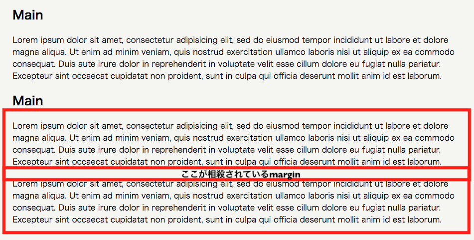

## マージンの相殺（margin collapse）

マージンの相殺とは、上下隣り合わせの要素では `top` と `bottom` のマージンが相殺され、結合されることがある現象のことを言います。

基本的には結合されるマージンのうち、値が大きい方のマージンに結合され、値の小さい方のマージンは相殺されてなくなります。

簡単な例をあげると、以下の様な `<p>` タグ要素の上下隣り合った `top` と `bottom` マージンは相殺されています。



```html
<div class="main-body">
  <h2>Main</h2>
  <p>Lorem ipsum dolor sit amet, consectetur adipisicing elit, sed do eiusmod tempor incididunt ut labore et dolore magna aliqua. Ut enim ad minim veniam, quis nostrud exercitation ullamco laboris nisi ut aliquip ex ea commodo consequat. Duis aute irure dolor in reprehenderit in voluptate velit esse cillum dolore eu fugiat nulla pariatur. Excepteur sint occaecat cupidatat non proident, sunt in culpa qui officia deserunt mollit anim id est laborum.</p>
  <h2>Main</h2>
  <p>Lorem ipsum dolor sit amet, consectetur adipisicing elit, sed do eiusmod tempor incididunt ut labore et dolore magna aliqua. Ut enim ad minim veniam, quis nostrud exercitation ullamco laboris nisi ut aliquip ex ea commodo consequat. Duis aute irure dolor in reprehenderit in voluptate velit esse cillum dolore eu fugiat nulla pariatur. Excepteur sint occaecat cupidatat non proident, sunt in culpa qui officia deserunt mollit anim id est laborum.</p>
  <!-- ちょうどこの箇所のmarginのtopとbottomが相殺され、40pxではなく、20pxになっている -->
  <p>Lorem ipsum dolor sit amet, consectetur adipisicing elit, sed do eiusmod tempor incididunt ut labore et dolore magna aliqua. Ut enim ad minim veniam, quis nostrud exercitation ullamco laboris nisi ut aliquip ex ea commodo consequat. Duis aute irure dolor in reprehenderit in voluptate velit esse cillum dolore eu fugiat nulla pariatur. Excepteur sint occaecat cupidatat non proident, sunt in culpa qui officia deserunt mollit anim id est laborum.</p>
</div>
```

```css
.main-body p {
  margin: 20px 0 20px 0;
}
```

## box-sizing: border-box

`padding` や `border` で微調整しながらそれぞれの要素ごとの横幅のバランスや並列をさせようとすると、思わぬところに要素が配置されていたり、横幅が予想しない長さではみ出していたりすることがあります。

`padding` や `border` で微調整しても良いのですが、あまり効率の良いやり方ではない上に、時間もかかってしまいます。

そこで、`padding` や `border` に依存せずに `width` や `height` を意図した通りに指定することのできる方法を使います。

 `box-sizing: border-box` を `padding` や `border-width` プロパティのある要素に指定すると、思い通りの `width` や `height` で並列してくれたり、長さが飛び出ることがなくなったり、意図した通りに要素を配置させることができます。

使い方は簡単で、 `padding` や `border-width` のかかっている要素に、 `box-sizing: border-box` も一緒にCSSに書くことで有効になります。

```html
<div class="header">
  <h4>ヘッダー</h4>
</div>

<div id="wrapper" class="clearfix">
  <div class="main-body">
    <h2>メイン</h2>
    <p>これはメインです</p>
  </div>
</div>
```

```css
.header {
  background-color: red;
  width: 1280px;
  height: 50px;
  padding: 13px 10px 10px 10px;
  box-sizing: border-box;/* paddingの値がこのままでもborder-boxで並列する */
}

.main-body {
  background-color: blue;
  width: 1000px;
  height: 530px;
  padding: 13px 10px 10px 10px;
  box-sizing: border-box;/* paddingの値がこのままでもborder-boxで並列する */
}
```

<iframe width="100%" height="300" src="//jsfiddle.net/codegrit_hiro/ja04vzq9/5/embedded/html,css,result/dark/" allowfullscreen="allowfullscreen" allowpaymentrequest frameborder="0"></iframe>

## まとめ

今までこのクラスで学んできた `float` やポジショニングについて、以下のプロパティの一覧で簡単におさらいしてみましょう。

| 表示と配置関係 | 指定の種類 |
| ------------- | -----:|
| float | 左か右に寄せて表示させる指定 |
| clear | 要素回り込み解除の指定 |
| display | 要素の表示の仕方の指定 |
| position | ボックスの配置方法の指定 |
| z-index | 要素の重なり方の順序指定 |

## 更に学ぼう

### 記事で学ぶ

- [floats - MDN(英語)](https://developer.mozilla.org/en-US/docs/Learn/CSS/CSS_layout/Floats)
- [CSS floatを初心者向けに図で解説　抑えるべき注意点とは？](https://udemy.benesse.co.jp/development/css-float.html)
- [Positioniing - MDN(英語)](https://developer.mozilla.org/en-US/docs/Learn)
- [マージンの相殺 - MDN](https://developer.mozilla.org/ja/docs/Web/CSS/CSS_Box_Model/Mastering_margin_collapsing)
- [box-sizing - MDN](https://developer.mozilla.org/ja/docs/Web/CSS/box-sizing)

### 動画で学ぶ

- [CSS入門 #20~#23 - ドットインストール](https://dotinstall.com/lessons/basic_css_v3)